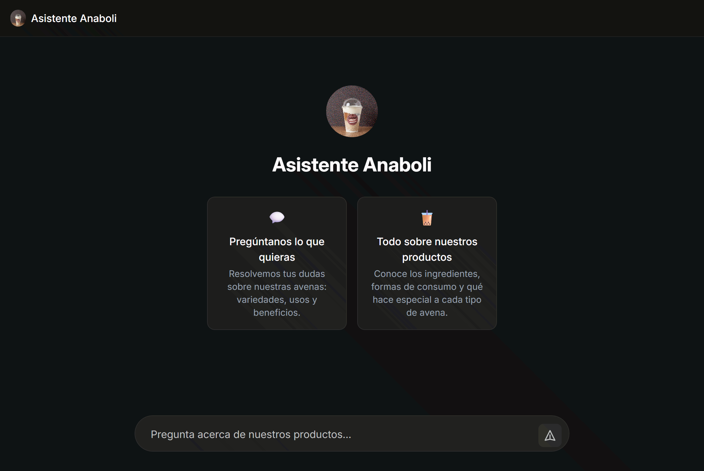

<div align="center">

# Anaboli Assistant AI


</div>

Anaboli Assistant es una aplicación de chat impulsada por IA construida con React, TypeScript y Vite. Proporciona una interfaz intuitiva para que los usuarios interactúen con un asistente de IA sobre productos y servicios.

## Características

- Interfaz de chat en tiempo real con indicadores de escritura
- Seguimiento del límite de mensajes con indicadores visuales
- Redimensionamiento automático del área de texto
- Límites de error para un manejo robusto de errores
- Diseño responsive con Tailwind CSS
- SSE (Eventos enviados por el servidor) para respuestas en streaming

## Capturas de pantalla

### Interfaz principal de chat



## Inicio rápido

### Requisitos previos

- Node.js 20.x o superior
- npm o yarn

### Instalación

```bash
npm install
```

### Desarrollo

```bash
npm run dev
```

### Construcción para producción

```bash
npm run build
```

### Ejecutar pruebas

```bash
npm run test
```

## Estructura del proyecto

```
src/
├── components/          # Componentes React
│   ├── ChatArea.tsx     # Interfaz principal de chat
│   ├── ChatInput.tsx    # Componente de entrada de mensaje
│   ├── MessageBubble.tsx # Visualización individual de mensaje
│   └── ErrorFallback/   # Componentes de límite de error
├── context/             # Proveedores de contexto React
│   ├── ChatContext.tsx  # Contexto principal de chat
│   ├── chatReducer.ts   # Reductor de estado de chat
│   └── ChatDispatchContext.tsx # Contexto de despacho de chat
├── services/            # Servicios API
│   └── api.ts           # Cliente API para conexiones SSE
├── utils/               # Funciones de utilidad
│   ├── formatters.ts    # Utilidades de formato de mensaje
│   └── errorMessages.ts # Constantes de mensajes de error
├── assets/              # Activos estáticos
│   ├── AnaboliLogo.jpg  # Logotipo de Anaboli
│   └── Milkshake.png    # Activos adicionales
└── App.tsx              # Componente principal de la aplicación
```

## Licencia

MIT
